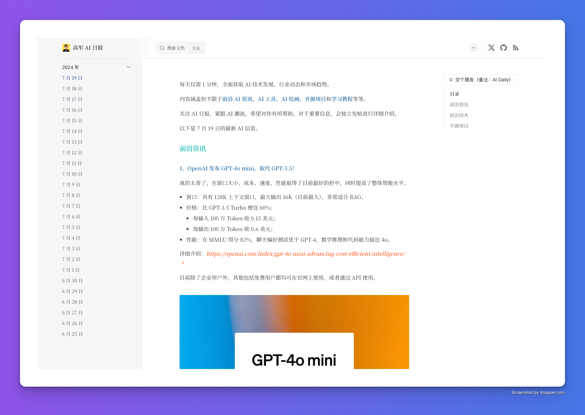

<h4 align="right"><strong>English</strong> | <a href="./README.zh.md">简体中文</a></h4>

<div align="center">

<a href="https://daily.gojun.me" target="blank">
  
</a>

# "GoJun AI Daily"

Spend 1 minute a day to get selected cutting-edge AI information.



</div>

The content covers but is not limited to **cutting-edge AI news**, **AI tools**, **AI drawing**, **open-source projects**, and **learning tutorials**, etc.

Updated regularly every evening, providing RSS service subscription, and you can also follow project updates via Star/Watch.

For more important information, it will be independently published on social channels for detailed introduction, and you can follow my [X (Twitter)](https://x.com/GoJun315) account.

## Features

1. 🌓 Provides light and dark mode switching to suit different reading environments.
2. 📡 Provides RSS subscription service, supporting content updates in both Chinese and English.
3. 💬 Integrated Giscus comment system for user interaction and feedback.
4. 🖼️ Supports high-definition image preview to enhance the visual experience.
5. 📜 Allows custom font settings to improve reading comfort.
6. 🔍 SEO optimization, including Sitemap generation, Twitter Card, and Open Graph tags to improve search engine visibility.

## TODO

- [ ] 🌍 Support for bilingual interface in Chinese and English to facilitate use by users of different languages.
- [ ] 📧 Provide email subscription service.

## Development

This project is built based on the [FAV0](https://github.com/Justin3go/FAV0) template, using the VitePress framework.

```bash
git clone git@github.com:Freelander/AI-Daily.git
cd AI-Daily

npm i -g pnpm # If necessary
pnpm i
pnpm docs:dev
```

**Directory Description:**

Mainly look at the files in the `docs` folder.

- `.vitepress`: All configurations of the website are in this folder.
  - `dist`: The output location of all resources generated by the website, also the target location for deployment.
  - `config`: Configurations related to the website's title, description, icon, language, navigation, tracking code, etc.
  - `theme`: Configurations related to the website's theme, page styles, and functional components (Giscus comments, appreciation), etc.
  - `utils`: Configurations related to the website's sidebar, RSS, metadata, etc.
- `assets/fonts`: The font packages used by the website.
- `posts/**` and `en/posts/**`: The files in this folder are your own output content.

If you need to carry out secondary development, it is recommended to have some understanding of VitePress first. Detailed documentation is [here](https://vitepress.dev/zh/).

## License

This repository is dual-licensed under the MIT License and the CC-BY-4.0 License:

- All `.md` files are under the CC-BY-4.0 License, and you need to retain the attribution.
- Other code files are under the MIT License, and you can freely use them.

Please refer to the [LICENSE](./LICENSE) file for specific content.