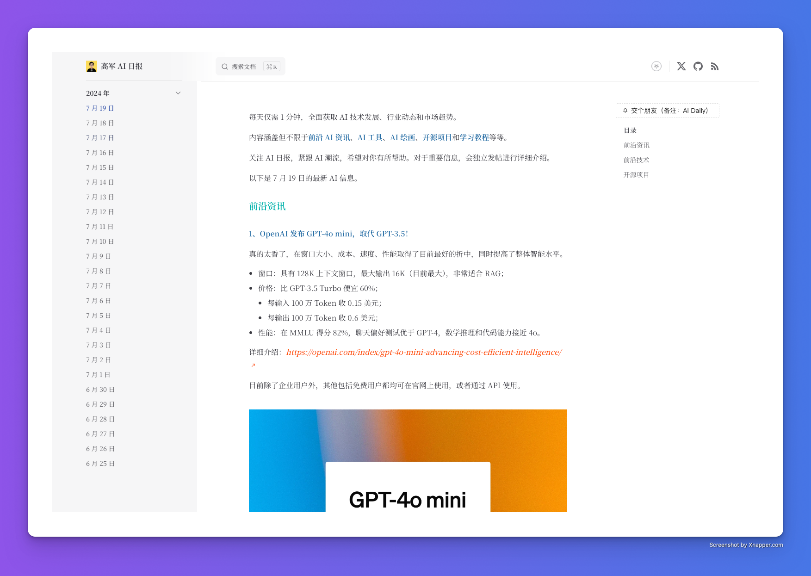

<h4 align="right"><a href="./README.md">English</a> | <strong>简体中文</strong></h4>

<div align="center">

<a href="https://daily.gojun.me" target="blank">
  
</a>

# 《高军 AI 日报》

每天花 1 分钟时间，获取精选的前沿 AI 信息。



</div>


内容涵盖但不限于 **前沿 AI 资讯**、**AI 工具**、**AI 绘画**、**开源项目**和**学习教程** 等等。

每天晚上定时更新，提供 RSS 服务订阅，也可通过 Star/Watch 关注项目的更新。

对于较为重要信息，会在社交渠道独立发布进行详细介绍，可关注我的 [X(Twitter)](https://x.com/GoJun315) 账号。


## 功能特性


1. 🌓 提供明暗模式切换功能，适应不同的阅读环境。
2. 📡 提供 RSS 订阅功能，支持中英文内容更新推送。
3. 💬 集成 Giscus 评论系统，便于用户交流和反馈。
4. 🖼️ 支持高清大图预览，优化视觉体验。
5. 📜 允许自定义字体设置，提升阅读舒适度。
6. 🔍 进行 SEO 优化，包括 Sitemap 生成、Twitter Card 和 Open Graph 标签支持，提高搜索引擎可见性。

## TODO

- [ ] 🌍 支持中英双语界面，方便不同语言用户的使用。
- [ ] 📧 提供邮件订阅功能。


## 开发

本项目基于 [FAV0](https://github.com/Justin3go/FAV0) 模板构建，使用的是 VitePress 框架。

```bash
git clone git@github.com:Freelander/AI-Daily.git
cd AI-Daily

npm i -g pnpm # 如果需要
pnpm i
pnpm docs:dev
```

**目录说明：**

主要看 `docs` 文件夹下的文件。

- `.vitepress`: 网站的所有配置均在该文件夹下。
  - `dist`: 网站生成的所有资源输出位置，部署时也是指向这里。
  - `config`: 网站的标题、描述、图标、语言、导航、跟踪代码等相关配置。
  - `theme`: 网站的相关主题、页面样式以及功能组件（Giscus 评论、赞赏）等相关配置。
  - `utils`: 网站的侧边栏、RSS 、元信息等相关配置。
- `assets/fonts`: 存放网站使用到的字体包。
- `posts/**` 与 `en/posts/**`: 该文件夹下的文件为你自己输出的内容。

如果你需要进行二次开发，建议先对 VitePress 有所了解，详细的文档 [在这里](https://vitepress.dev/zh/)。

## 协议

本仓库采用双协议授权，即MIT协议和CC-BY-4.0协议：

- 所有`.md`文件采用CC-BY-4.0协议协议，你需要保留署名权
- 其他代码文件采用MIT协议，你可以自由使用

具体内容请查看[LICENSE](./LICENSE)文件。
